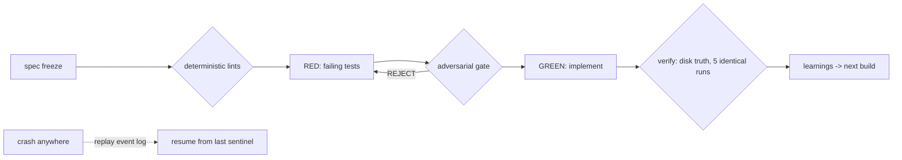

# ByteDigger

Everybody lies. Coding agents are no exception: they'll mock the very unit you asked them to test, then report green with a straight face. You can keep paying a review loop to catch them lap after lap -- or you can catch the lie before the code exists. That's the whole idea here. The spec compiles into checks a machine can run, failing tests survive a hostile audit before anyone writes the implementation, and the expensive model gets spent once -- on the build, not on the do-overs.

> [Shrinking the Human in the Loop](docs/article.md) -- the story of how this pipeline came to be.

## Why this is different

Three familiar ways to get AI-written code, one shared flaw:

- **Coding agents** -- Copilot, Cursor, Claude Code on its own -- write the tests, write the code, run the tests, report green. They grade their own homework.
- **Agent frameworks and harnesses** orchestrate the calls, then take the agent's word that the work is done.
- **AI review loops** add a second model to check the first. Same training, same blind spots: when a test gets bent to match broken code, writer and reviewer both call it green.

ByteDigger verifies the acceptance signal itself, with checks that run as code, not as another model's opinion:

| | typical agent stack | ByteDigger |
|---|---|---|
| who verifies the work | the agent; you trust its report | the engine runs the tests in a subprocess it owns and checks every claim against the real git diff |
| gamed tests | a test that mocks its own unit ships; assertions bend to match reality | deterministic lints reject both, no model involved |
| security | a scan later in CI, maybe | changed Dockerfile or Terraform detected up front; fail-closed scan inside the build |
| crash mid-build | start over, pay again | resume from the last success sentinel |
| learning | every build starts amnesiac | learnings extracted, stored, injected into the next build |
| reviewer findings | prose, unverified | every path:line:quote citation checked against disk |

`pip install -e engine_py`, run the [keyless demo](examples/verified-tdd-run/), point it at your own LLM in [20 lines](examples/library/custom_backend.py). Also ships as a Claude Code plugin (`/build`).

## Security first, shift left

The usual fix is a review loop after generation: expensive, slow to converge, reviewer and writer sharing blind spots. ByteDigger moves the checks to before the code exists. The spec freezes with an AC table and a file allowlist, so scope drift dies at write time. Failing tests face a hostile audit before a single line of implementation. Secure-codegen rules ride inside the generation prompt, and a semgrep gate lints the tests as they land. The engine detects a changed Dockerfile, Kubernetes manifest, or Terraform file up front and routes the build into a fail-closed security scan. Reviewers still run at the end; the design goal is that they find nothing.

## The pipeline

A state machine, not a conversation. Gates fail closed; nothing proceeds on the agent's say-so.



Every step appends to a frozen event log; sentinels land on success only, so a killed build resumes mid-pipeline and never repays a completed model call.

## The checks that make it real

The mechanisms doing the heavy lifting, each one shipping as code in `engine_py/`:

- **Citation verifier** (`lib/plugins/anti_hallucination/`) -- a reviewer finding must cite path, line, and quote; the verifier checks each citation against the file on disk, demotes fabricated findings to an Unverified section, and recomputes the verdict without them.
- **Stub-passability lint** -- a RED test that imports a symbol and mocks that same symbol verifies nothing; automatic reject, no model involved.
- **Disk truth** (`lib/plugins/disk_truth/`) -- cross-checks RED and GREEN claims against the real git diff and the real test-runner subprocess output, not the agent's transcript.
- **Reproducibility gate** -- the test command runs five times; identical pass/fail counts required before the engine enforces the RED-to-GREEN delta. Flaky suites don't get to vote.
- **Durable resume** -- success-only sentinels plus an append-only event log with replay; a sticky error can never replay as progress.
- **Learning loop** -- phase 7 extracts categorized learnings from each build; an injection step feeds them, plus a project constitution and security rules, into the next build's context.

## What's in the box

The core is a sequential workflow engine (`engine_py/`) with phases registered as workflows: research, spec, implement (the RED/gate/GREEN loop), review, synthesize. State comes from replaying an append-only JSONL event log -- there is no mutable state file to drift or race.

The spec itself has a machine-readable half. Alongside the prose, an `AC-checks` yaml block maps each acceptance criterion to a mechanical check from a closed registry -- file-contains, command-exit-code and friends -- validated at spec-freeze time and executed as code, so "done" is the AC table passing rather than anyone's judgment. A criterion that can't live without judgment has to declare itself as one (`llm_rubric`), which keeps the escape hatch visible instead of ambient. Specs stop being documentation that drifts; they compile.

The engine installs with zero runtime dependencies and no LLM vendor baked in. Anthropic, Azure OpenAI, and Claude Code backends ship as references; plugging in your own is [about 20 lines](examples/library/custom_backend.py).

## Under the hood

The pipeline sketch above is seven boxes; the engine behind it is 27 workflow modules, phase 0 research through phase 8 post-deploy -- including a spec-lite lane for small tasks, a DevOps pipeline, integrity and smoke phases, and a review fastpath for simple changes. When the changed files include a Dockerfile, Kubernetes manifest, Terraform, or CI config, phase 0.6 detects the artifact type and routes the build into a fail-closed security scan whose allowlist waivers carry expiry dates.

Beyond the headline lints above, the deterministic set includes spec-cite (every path:line citation in the spec verified against the real repository before freeze), net-new delta (the RED-to-GREEN improvement must be net-new passes, not reshuffled counts), token-consistency, presence-triad, re-entry AC, suite-safety, and forbidden-import -- each one a codified post-mortem. A test-integrity diff guard classifies post-RED test edits and hard-fails on assertion gaming; a scope lint flags implementation writes outside the spec's file allowlist.

When a gate fails, a cheap model fronts the FAIL branch to draft the repair; the gate re-runs afterwards and stays the correctness authority. A restart governor caps re-invocation (and knows a crash-start from a gate-start), and every subprocess goes through one spawn chokepoint with a mandatory timeout, so an unbounded hang is impossible by construction. An optional DBOS backend adds durable run listing and status. Cost and token rollups per run, phase, and cycle come straight from the event log, and every REVISE or FAIL reason lands in durable JSONL ledgers -- a reject log and a spec-defect ledger with a bounded reroute budget for specs that turn out defective.

On the learning side, phase 7 synthesizes categorized learnings from each build into a pluggable store: markdown files under `.bytedigger/learnings/` by default, and a reference SQLite shell backend with a documented schema shows how to plug in your own. Before implementation, an injection step assembles a context folder: matched learnings from whichever store you wired in, a project constitution discovered by precedence, quality-gate rules, security rules, active-work context. Lessons from build N are in the prompt for build N+1.

The engine even gates changes to itself: a commit-msg hook blocks any commit touching engine production code unless it co-stages an APPROVED audit document, and self-attested LLM verdicts get an anchor-hash and AC-parity cross-check against the on-disk files before they count.

## Quickstart

Five minutes, no API key needed:

```bash
git clone https://github.com/guy-lifshitz/bytedigger
cd bytedigger/engine_py

python3 -m venv .venv && source .venv/bin/activate
pip install -U pip   # stock macOS 3.9 ships a pre-PEP660 pip that cannot editable-install
pip install -e .

# smoke: run a workflow, replay its event log
bytedigger-engine --workflow echo --ctx-json '{"question":"hello"}' --event-log /tmp/events.jsonl
bytedigger-engine --derive-state /tmp/events.jsonl

# the verified-TDD loop end to end on a toy repo, keyless
python3 ../examples/verified-tdd-run/run_demo.py
```

The [verified-tdd-run example](examples/verified-tdd-run/) walks a frozen spec with an AC table through the loop against a toy repository and shows a gate rejection along the way. From there:

```bash
pip install -e ".[test]" && python3 -m pytest tests/   # 300+ hermetic tests
pip install -e ".[agentic-pydantic]"                   # real API backends
```

Backend setup (env vars, model aliases, selection) is in [docs/backends.md](docs/backends.md).

## Use with Claude Code

The same discipline is available as a Claude Code plugin -- `/build "add email verification"` classifies the task, routes it through the phase pipeline, and enforces the TDD loop with hooks between phases:

```bash
claude plugin marketplace add guy-lifshitz/bytedigger
claude plugin install bytedigger@bytedigger
```

Phase 6 runs a parallel reviewer panel (code review, silent-failure hunting, test coverage, and a security reviewer on high-risk changes) modeled on Anthropic's pr-review-toolkit; set `reviewers.mode: "toolkit"` to use the toolkit agents themselves when installed. See [examples/claude-code-skill/](examples/claude-code-skill/) for a manual per-project install and [docs/plugin.md](docs/plugin.md) for the full plugin reference (configuration flags, complexity routing, reviewer modes). The plugin predates the Python engine and is the layer we still drive day to day; the engine is the extracted, host-independent core of it.

## Bring your own LLM

Every LLM call goes through one dispatcher with a named-backend registry. `register_backend` is the public seam:

```python
from llm_subprocess import register_backend

register_backend("my-backend", my_callable, manifest_source="orchestrator_observed")
```

Reference backends in `engine_py/lib/reference_backends/` cover the Anthropic Messages API (text, stdlib-only), agentic Pydantic AI backends for OpenAI-compatible and Anthropic providers (write files, run tests), and the Claude Agent SDK. [docs/backends.md](docs/backends.md) has the full inventory. Deterministic phases and the whole test suite run without any LLM configured.

## Repository layout

| Path | What |
|------|------|
| `engine_py/` | The Python engine: state machine, event log, gates, workflows, tests |
| `examples/` | Keyless demos: [minimal run](examples/library/), [custom backend](examples/library/custom_backend.py), [verified-TDD loop](examples/verified-tdd-run/) |
| `docs/` | [Backends](docs/backends.md), [plugin reference](docs/plugin.md), [event schema](docs/events.md), [the article](docs/article.md) |
| `phases/`, `commands/`, `hooks/`, `scripts/`, `skills/` | The Claude Code plugin (orchestration layer) |

## Security

The engine runs LLM-generated code -- that's the GREEN phase doing its job. Run it in a container or a throwaway worktree; the deterministic gates keep the model honest, they do not contain it. Keys come in through env vars only and never land in the event log. [docs/security.md](docs/security.md) spells out the threat model; [SECURITY.md](SECURITY.md) has the private reporting channel for anything exploitable.

## Non-goals

Multi-agent orchestration frameworks are well covered elsewhere. This project stays narrow on purpose: one sequential engine, one event log, and a growing set of deterministic gates that keep generated code honest.

## License

MIT -- see [LICENSE](LICENSE).
